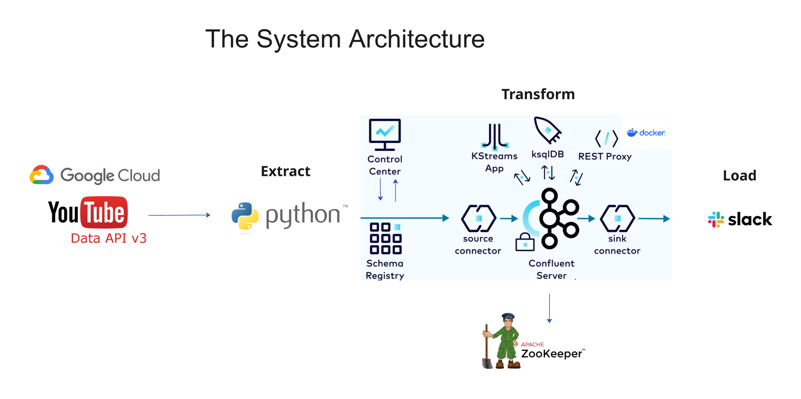
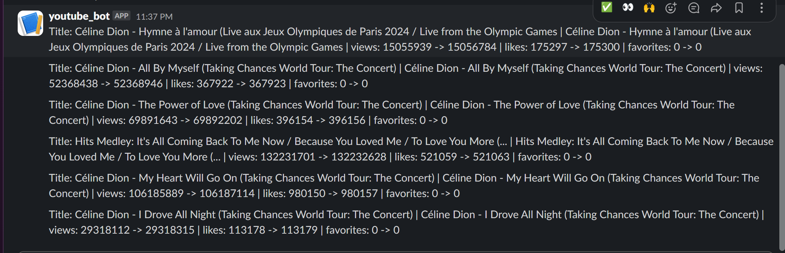

# Pipeline d'analytique YouTube


Diffusez les métriques des vidéos YouTube dans Kafka et traitez-les avec ksqlDB, avec en option l'envoi vers Slack via le connecteur HTTP de Kafka Connect.

## Vue d'ensemble
* __Producteurs__: Scripts Python (`list.py`, `youtubeanalytic.py`) qui récupèrent les statistiques via l'API YouTube Data et publient dans le topic Kafka `youtube_videos`.
* __Pile Kafka__: Zookeeper, Broker Kafka, Schema Registry, Kafka Connect, ksqlDB Server et Confluent Control Center sont définis dans `docker-compose.yaml`.
* __Traitement de flux__: Les streams/tables ksqlDB définis dans `ksql/create-stream-table.md` calculent les deltas de métriques et formatent les messages.
* __Sorties__: Le sink HTTP Slack via Kafka Connect lisant depuis `slack_output`.

## Architecture



## Structure du dépôt
* `docker-compose.yaml` – Services Confluent Platform.
* `constants.py` – Lit les valeurs de config/clé API depuis `config/config.local`. Le config est privé
* `list.py` – Publie les métriques des vidéos d'une playlist vers Kafka (`youtube_videos`).
* `youtubeanalytic.py` – Publie les métriques d'une seule vidéo vers Kafka.
* `ksql/create-stream-table.md` – SQL ksqlDB pour créer les streams/tables + le config du sink Slack.
* `connectors/` – Point de montage des plugins personnalisés pour Kafka Connect.
* `requirement.txt` – Dépendances Python.

## Prérequis
* Docker et Docker Compose
* Python 3.10+
* Une clé API YouTube Data

## Configuration
Créez `config/config.local` avec votre clé API et vos identifiants :

```ini
[youtube]
API_KEY = <VOTRE_CLE_API_YOUTUBE>
PLAYLIST_ID = <PLAYLIST_ID_OPTIONNEL>
VIDEO_ID = <VIDEO_ID_OPTIONNEL>
```

`constants.py` charge ces valeurs pour les producteurs.

## Installer les dépendances Python

```bash
python -m venv .venv
source .venv/bin/activate
pip install -r requirement.txt
```

## Démarrer la pile Kafka

```bash
docker compose up -d
```

Services (ports par défaut) :
* __Broker Kafka__ : 9092 (hôte), 29092 (interne)
* __Zookeeper__ : 2181
* __Schema Registry__ : 8081
* __Kafka Connect__ : 8083
* __ksqlDB Server__ : 8088
* __Control Center__ : 9021 (UI: http://localhost:9021)

## ksqlDB : Créer les streams et tables
Pour tous les détails ksqlDB, consultez :

- [Guide ksqlDB pas-à-pas](ksql/readme.md)

Utilisez le SQL dans `ksql/create-stream-table.md`. Le topic source `youtube_videos` doit exister (les producteurs le créeront en envoyant des messages).

Flux standard défini dans le document :
* `youtube_videos` stream (JSON)
* `youtube_analytics_changes` table (deux dernières mesures par vidéo)
* `youtube_analytics_change_stream_base` stream (sur le changelog de la table)
* `youtube_analytics_change_stream` stream dérivé avec texte formaté et filtres
* `slack_output` stream (Avro) pour le sink Slack

## Exécuter les producteurs
Avec la pile démarrée et `config/config.local` renseigné :

- __Publier les métriques d'une seule vidéo__

  ```bash
  python3 youtubeanalytic.py
  ```

- __Publier les métriques pour tous les éléments d'une playlist__

  ```bash
  python3 list.py
  ```

Les deux scripts envoient des messages JSON vers le topic Kafka `youtube_videos` avec la clé = `video_id` (dans `list.py`).

## Sink HTTP Slack via Kafka Connect
La configuration de connecteur est inclus en bas de `ksql/create-stream-table.md`. Envoyez-le à Kafka Connect une fois que les topics/streams existent et que vous avez une URL de webhook Slack.

 Assurez-vous que le connecteur lit depuis `slack_output` et applique une transformation pour renommer `TEXT` -> `text`.

## Topics
* `youtube_videos` – entrée des producteurs (JSON)
* `youtube_analytics_changes` – changelog de la table (JSON)
* `youtube_analytics_change_stream` – texte formaté/filtré (JSON)
* `slack_output` – sink final (Avro)

## Résultat
Sur Slack, on a un bot qui va envoyer des messages.

